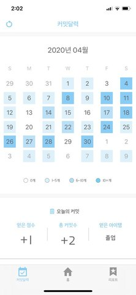

# GitCat 깃캣

**[AppStore 출시](https://apps.apple.com/kr/app/gitcat/id1510368007)**

개발 기간 : 2020년 01월 01일 ~ 

## [ About ]

**고양이와 함께하는 Github 커밋 관리 앱**입니다.

**1. 개발 파트너 고양씨**  
깜찍한 나의 파트너와 함께 꾸준히 커밋으로 목표를 달성해요. 

**2. 커밋 달력**  
직관적인 잔디 달력으로 일일 커밋 현황을 꼼꼼히 확인해요.

**3. 월간 리포트**  
매월 첫째날 발송되는 리포트로 한 달간 나의 개발을 되돌아보아요.

## [ WorkFlow ]             

## [ Preview ]
| 홈                    | 잔디달력                                  | 리포트                                  |
|:------------------------------:|:---------------------------------:|:---------------------------------:|
| | | |

## [ Develop Environment ]
- iOS Depolyment Target : `Xcode 11.4.1`
- CocoPods Version:  `1.9.1`

## [ Library ]

1. Server
- [Alamofire](https://github.com/Alamofire/Alamofire)
- [Kingfisher](https://github.com/onevcat/Kingfisher)
- [SwiftJSON](https://github.com/SwiftyJSON/SwiftyJSON)

2. Layout
- [Charts](https://github.com/danielgindi/Charts)
- [SwiftyGifOrigin](https://github.com/swiftgif/SwiftGif)

